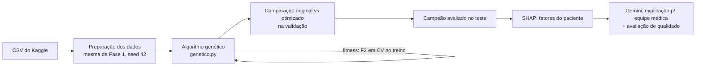

# Arquitetura - Fase 2

Escolhi o **Projeto 1** do enunciado: otimizar os modelos de diagnóstico da
Fase 1 com algoritmo genético e usar uma LLM para interpretar os resultados.

## Visão geral

## Componentes

- **`notebooks/tech_challenge_fase2.ipynb`**: notebook principal, com baselines,
  experimentos, comparação e integração com a LLM;
- **`genetico.py`**: o algoritmo genético. O indivíduo é um dicionário
  `{hiperparâmetro: valor}`; seleção por torneio, cruzamento uniforme, mutação
  por re-sorteio do gene e elitismo;
- **`test_genetico.py`**: testes dos operadores e da convergência (`pytest`);
- **`results/`**: gerado ao rodar, com o log dos experimentos e o histórico de
  cada execução em CSV.

## Decisões

- **Fitness = F2-score em validação cruzada (3 folds) dentro do treino.** O F2
  dá peso dobrado ao recall, coerente com a conclusão da Fase 1 de que o falso
  negativo é o erro mais grave na triagem. Validação e teste ficam fora do
  fitness; a validação compara original × otimizado e o teste é usado uma única
  vez, no campeão.
- **Espaço de busca em listas de valores** por hiperparâmetro: simples de
  entender e suficiente para os 3 modelos (o maior espaço, do Random Forest,
  tem 2.700 combinações, inviável de testar uma a uma, e o GA encontra boas
  soluções avaliando umas 100).
- **3 experimentos** variando população (12/20) e taxa de mutação (0.1/0.2/0.4),
  como pede o enunciado, com log e histórico por geração salvos em `results/`.
- **LLM = Gemini** (`gemini-2.5-flash`, chave gratuita). O prompt manda os dados
  do paciente, a probabilidade e os fatores SHAP, e instrui: não inventar dados,
  não prescrever, deixar claro que é triagem e não diagnóstico. A qualidade da
  explicação é avaliada por uma segunda chamada com uma rubrica de 4 critérios.
