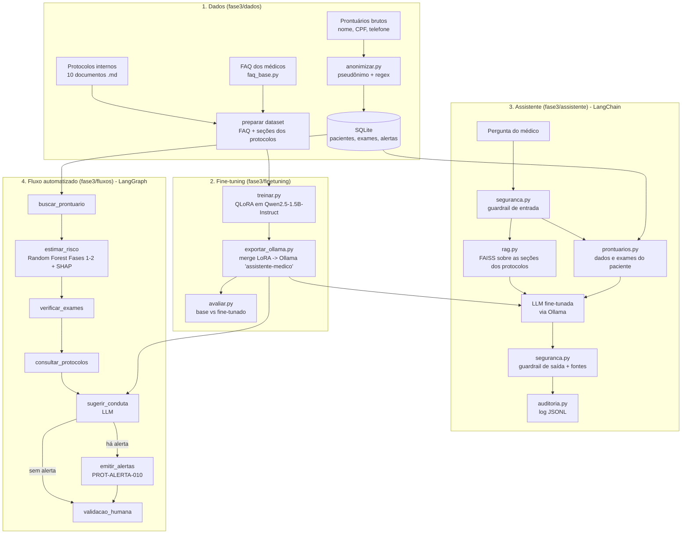

# Arquitetura - Fase 3

O hospital das Fases 1 e 2 (o "Hospital Universitário de Ensino", HUE) agora quer
um **assistente virtual médico** treinado com os próprios protocolos, que
responda dúvidas da equipe citando a fonte, consulte o prontuário e dispare
fluxos automáticos (exames pendentes, alertas) - sempre com validação humana.

## Visão geral

## Componentes

| Pasta / arquivo | O que faz |
|---|---|
| `data/fase3/protocolos/*.md` | 10 protocolos sintéticos do HUE (AVC, hipertensão, diabetes, sepse, dor torácica, antitrombóticos, modelos de documentos, alta, exames, alertas) |
| `fase3/dados/faq_base.py` | ~70 perguntas de médicos com paráfrases e resposta de referência, mais 5 blocos de pedidos que o assistente deve recusar |
| `fase3/dados/anonimizar.py` | pseudônimo estável (SHA-256 com sal) no lugar do CPF, remoção de nome/telefone/endereço, nascimento -> idade, regex para CPF/telefone/e-mail/data em texto livre |
| `fase3/dados/gerar_dados.py` | gera os prontuários brutos, anonimiza, cria o SQLite, o FAQ em JSONL e o dataset de fine-tuning (treino/validação) |
| `fase3/finetuning/treinar.py` | QLoRA (4 bits NF4 + LoRA r=16 em todas as projeções) no Qwen2.5-1.5B-Instruct; só os tokens da resposta entram na loss |
| `fase3/finetuning/exportar_ollama.py` | mescla o LoRA no modelo em fp16, converte para GGUF com o conversor do llama.cpp (baixado automaticamente) e registra no Ollama com o template ChatML |
| `fase3/finetuning/avaliar.py` | compara base × fine-tunado nas perguntas de validação: ROUGE-L, cita o protocolo certo, mantém o aviso de validação |
| `fase3/assistente/rag.py` | quebra os protocolos por seção, indexa em FAISS com embeddings multilíngues; cada trecho carrega `protocolo` + `seção` (a fonte citada) |
| `fase3/assistente/prontuarios.py` | consultas ao SQLite: paciente, exames pendentes com atraso em relação ao prazo do PROT-EXAMES-009, alertas |
| `fase3/assistente/seguranca.py` | limites de atuação em código: bloqueia pedidos de prescrição/emissão de documento/decisão autônoma; acrescenta o aviso de validação e a marca de rascunho |
| `fase3/assistente/auditoria.py` | log estruturado (JSONL) de toda interação: pergunta, fontes, resposta, ajustes, alertas, usuário, horário |
| `fase3/assistente/chain.py` | a chain do LangChain que junta tudo (classe `Assistente`) |
| `fase3/fluxos/triagem_avc.py` | Random Forest das Fases 1-2 (hiperparâmetros do GA) como ferramenta do fluxo, com SHAP por paciente |
| `fase3/fluxos/grafo.py` | o grafo do LangGraph com 8 nós e 2 desvios condicionais |
| `fase3/app.py` | CLI: `pacientes`, `pergunta`, `chat`, `fluxo`, `auditoria` |
| `test_fase3.py` | testes de anonimização, dados, guardrails, prontuários e regras de alerta (sem GPU/Ollama) |

## Decisões

- **Modelo-base: Qwen2.5-1.5B-Instruct.** Aberto (Apache 2.0, sem cadastro), bom
  em português e pequeno o bastante para o QLoRA caber numa GPU de 8 GB e para a
  inferência rodar local no Ollama. Um modelo maior responderia melhor, mas não
  treinaria nem rodaria no hardware disponível.
- **QLoRA em vez de fine-tuning completo.** Treina ~1,2% dos parâmetros (18,5 M
  de 1,56 B), em 6 minutos, e o adaptador tem poucos MB. O modelo mesclado é o
  que vai para o Ollama.
- **Exportação via GGUF (llama.cpp), não import direto de safetensors.** O
  Ollama aceita `FROM <pasta safetensors>`, mas a conversão interna travou por
  horas nesta máquina; o `convert_hf_to_gguf.py` do llama.cpp faz a mesma
  conversão em menos de um minuto e o `ollama create` a partir do GGUF é
  imediato. O script baixa o conversor sozinho (sparse checkout).
- **Dataset = FAQ (paráfrases) + seções dos protocolos.** As paráfrases ensinam
  o *estilo* (objetivo, cita PROT-XXX, lembra que a decisão é do médico); as
  seções ensinam o *conteúdo*. A validação usa só FAQ que o modelo não viu.
  Exemplos de recusa ensinam o limite de atuação.
- **RAG mesmo com fine-tuning.** O fine-tuning dá o estilo e parte do conteúdo,
  mas um modelo de 1,5B alucina detalhes; o RAG coloca o trecho exato do
  protocolo no prompt e permite **citar a fonte** (seção do documento) em toda
  resposta - é a explainability pedida no enunciado.
- **Prontuário por consulta determinística, não por SQL gerado pela LLM.** Um
  modelo de 1,5B não é confiável para gerar SQL; as funções em `prontuarios.py`
  fazem as consultas e a LLM só recebe o resumo. O mesmo vale para o LangGraph:
  os nós são funções Python, e a LLM só escreve a sugestão final.
- **Segurança em duas camadas.** O modelo fine-tunado aprendeu a recusar, mas a
  regra de "nunca prescrever" não pode depender do modelo: `seguranca.py`
  bloqueia os pedidos antes da LLM e garante o aviso depois.
- **Alertas seguem o PROT-ALERTA-010** (função pura, testada): risco de AVC >= 50%
  gera amarelo, exame crítico fora do prazo gera vermelho; tudo termina em
  `validacao_humana`.
- **Anonimização antes de tudo.** Os dados "brutos" (sintéticos, com nome e CPF
  fictícios) nunca entram no git nem no treino; só a versão anonimizada.

## Resultado da avaliação (14 perguntas de validação, temperatura 0)

| configuração | ROUGE-L | cita algum PROT | cita o PROT certo | aviso de validação |
|---|---|---|---|---|
| qwen2.5:1.5b (base) | 0,12 | 0% | 0% | 29% |
| assistente-medico (fine-tunado) | 0,22 | 71% | 0% | 71% |
| base + RAG | 0,28 | 64% | 43% | 71% |
| **fine-tunado + RAG** | 0,28 | **93%** | **71%** | **86%** |

Leitura: o fine-tuning ensinou a *forma* (citar um protocolo, devolver a decisão
ao médico, responder curto), mas sozinho inventa códigos e números; o RAG traz o
*conteúdo* certo. Os dois juntos são a melhor configuração, e é a que o
assistente usa. Detalhes em `reports/relatorio_fase3.docx`.

## Limitações

- Dados sintéticos: protocolos e prontuários foram escritos para o exercício e
  não refletem diretrizes oficiais.
- Modelo pequeno: mesmo com RAG, a resposta precisa ser lida com o protocolo ao
  lado - por isso as fontes sempre aparecem.
- Avaliação automática (ROUGE-L, citação da fonte) mede aderência ao estilo e
  ao conteúdo; a qualidade clínica só seria validada por médicos.
